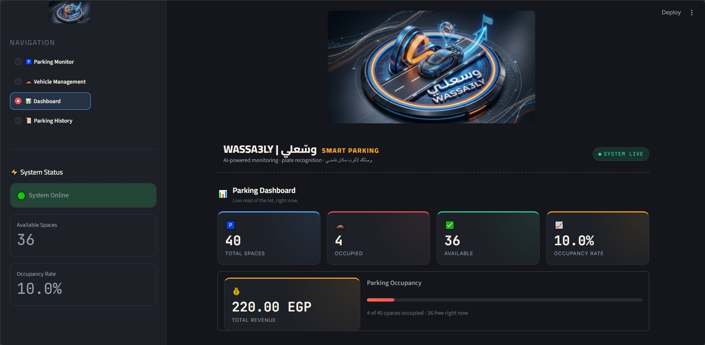

# 🚗 WASSA3LY | وسّعلي

### Smart Parking Management System

> **WASSA3LY** is an AI-powered smart parking management system that combines **Computer Vision, Vehicle Detection, License Plate Recognition, OCR, Parking Management, and Data Analytics** to automate parking monitoring and management.

---

## 📌 Overview

WASSA3LY aims to make parking management smarter and more efficient by automatically detecting vehicles, monitoring parking spaces, recognizing license plates, managing parking sessions, and calculating parking fees.

The system combines:

* 🚗 Vehicle & Parking Detection
* 🅿️ Parking Occupancy Monitoring
* 🔢 License Plate Recognition
* 🔍 OCR
* 🆔 Vehicle Identification
* ⭐ VIP Management
* ⏱️ Parking Duration Calculation
* 💰 Automatic Fee Calculation
* 📊 Parking Analytics
* 🗄️ SQLite Database
* 🖥️ Streamlit Dashboard

---

# 🏗️ System Architecture

```text
                    📷 Image / Video
                           │
                           ▼
                 ┌───────────────────┐
                 │   YOLO Detection  │
                 └─────────┬─────────┘
                           │
              ┌────────────┴────────────┐
              ▼                         ▼
     🅿️ Parking Occupancy        🚘 Vehicle Tracking
        ROI / Polygon                    │
              │                          ▼
              │                  🔢 License Plate
              │                          │
              │                          ▼
              │                     Fast-ALPR
              │                          │
              └────────────┬─────────────┘
                           ▼
                  🧠 Parking Logic
                           │
              ┌────────────┼────────────┐
              ▼            ▼            ▼
            ⭐ VIP       ⏱️ Duration    💰 Fee
                           │
                           ▼
                     🗄️ SQLite DB
                           │
                           ▼
                  🖥️ Streamlit App
```

---

# 🤖 AI Models & Performance

## 🚗 Parking Detection

The parking detection model was trained to detect:

* `car`
* `free`

### Performance

| Metric        |     Score |
| ------------- | --------: |
| **mAP@50**    | **98.8%** |
| **Precision** | **97.9%** |
| **Recall**    | **97.4%** |

### Dataset

* **2,963 images**
* **2 classes**
* **8 dataset versions**

### Per-Class Performance

| Class | Precision | Recall | mAP@50 |
| ----- | --------: | -----: | -----: |
| Car   |     94.7% |  91.1% |  93.7% |
| Free  |     94.0% |  89.6% |  93.3% |

---

## 🔢 License Plate Recognition

WASSA3LY uses **Fast-ALPR** for automatic license plate recognition.

**Detector:**

```text
yolo-v9-t-384-license-plate-end2end
```

**OCR:**

```text
cct-xs-v2-global-model
```

### OCR Performance

**Average OCR Confidence: 96.7%**

The extracted plate number is passed to the parking management system to identify and manage the vehicle.

---

# 🅿️ Parking Occupancy

Parking spaces are defined using **ROI / Polygon regions**.

The system determines:

```text
🟢 Available
🔴 Occupied
```

and calculates:

* Total Spaces
* Occupied Spaces
* Available Spaces
* Occupancy Rate

### Occupancy Rate

```text
Occupancy Rate =
(Occupied Spaces / Total Spaces) × 100
```

---

# 🧠 Parking Management

The backend manages the complete parking lifecycle:

```text
Vehicle Entry
      ↓
Plate Recognition
      ↓
Vehicle Identification
      ↓
Parking Space Assignment
      ↓
Active Parking Session
      ↓
Vehicle Exit
      ↓
Duration Calculation
      ↓
Fee Calculation
      ↓
Parking History
```

---

# ⭐ VIP & Pricing

The system supports VIP vehicles with a separate pricing rule.

| Vehicle Type |           Fee |
| ------------ | ------------: |
| 🚗 Regular   | **20 / hour** |
| ⭐ VIP        | **40 / hour** |

The system automatically checks the vehicle's plate against the VIP database.

---

# 📊 Streamlit Dashboard

The application provides an interactive dashboard containing:

### 🅿️ Parking Monitor

Real-time parking occupancy and parking-space status.

### 🚘 Vehicle Management

Vehicle information and active parking sessions.

### 📈 Dashboard

Key parking statistics and KPIs.

### 🕒 Parking History

Complete history of previous parking sessions.

---

# 🗄️ Database

WASSA3LY uses **SQLite** for data management.

### Main Tables

```text
Vehicles
Parking Spaces
Parking Sessions
VIP
```

The database stores vehicle information, parking spaces, entry/exit times, parking duration, fees, and VIP information.

---

# 🛠️ Tech Stack

### AI & Computer Vision

* Python
* YOLO
* Ultralytics
* OpenCV
* Fast-ALPR
* OCR

### Backend

* Python
* SQLite
* SQL

### Frontend

* Streamlit

### Data Processing

* NumPy
* Pillow

---

# 📁 Project Structure

```text
WASSA3LY/
│
├── backend/
│   ├── database.py
│   └── parking_logic.py
│
├── models/
│   └── ...
│
├── app.py
├── integration.py
├── requirements.txt
├── .gitignore
└── README.md
```

---

# ⚙️ Installation

### 1. Clone the Repository

```bash
git clone <YOUR_GITHUB_REPOSITORY_URL>
cd WASSA3LY
```

### 2. Create Virtual Environment

```bash
python -m venv venv
```

### 3. Activate Environment — Windows

```bash
venv\Scripts\activate
```

### 4. Install Dependencies

```bash
pip install -r requirements.txt
```

### 5. Run the Application

```bash
streamlit run app.py
```

---

# ✨ Key Features

* 🚗 AI-based vehicle detection
* 🅿️ Automated parking occupancy detection
* 🎯 ROI / Polygon parking-space mapping
* 🚘 Vehicle identification
* 🔢 License plate recognition
* 🔍 OCR
* ⚡ Fast-ALPR integration
* ⭐ VIP management
* ⏱️ Automatic parking duration
* 💰 Automatic fee calculation
* 🗄️ SQLite database
* 📊 Parking analytics
* 🖥️ Streamlit dashboard
* 📜 Parking history
* 💵 Revenue tracking

---

# 👥 Team

| Member            | Role                                    |
| ----------------- | --------------------------------------- |
| **Rawda Badawy Ali Abdel Tawab**          | Computer Vision & YOLO Engineer         |
| **Kerimena Ehab Hafez Badee**        | Tracking & License Plate / OCR Engineer |
| **Salma Mohamed Nageh Abdelhamid**          | Backend, Database & System Architecture |
| **Fatma Al-Zahraa Ibrahim Abbas Salman** | Streamlit & System Integration          |

### 👩‍💻 Rawda Badawy Ali — Computer Vision & YOLO

* Dataset preparation & cleaning
* YOLO training & evaluation
* Vehicle detection
* Parking-space detection
* ROI / Polygon
* Occupancy calculation

### 👩‍💻Kerimena Ehab Hafez — Tracking & OCR

* Object tracking
* Vehicle IDs
* License plate detection
* OCR
* Fast-ALPR
* Plate ↔ Vehicle identification

### 👩‍💻 Salma Mohamed Nageh — Backend & System Architecture

* Database design
* Parking logic
* Entry / Exit management
* Duration & fee calculation
* VIP logic
* Parking history
* Revenue calculation
* **System Architecture**
* **System Integration**

### 👩‍💻Fatma Al-Zahraa Ibrahim Abbas Salman— Streamlit & Integration

* Streamlit UI
* Parking Monitor
* Dashboard
* Vehicle Management
* Parking History


---

### 📸 Application Screenshots

### 🅿️ Parking Monitor


### 🚗 Vehicle Management
### 🚗 Vehicle Management


### 📊 Dashboard



### 📜 Parking History


> 

```text
Parking Monitor
Dashboard
Vehicle Management
Parking History
Parking Map
```

---

# 🔗 Project Links

### 📂 GitHub

**[(https://github.com/SalmaNageh/-WASSA3LY-)]**

### 🎥 Demo

**[ADD DEMO VIDEO LINK]**

### 📑 Presentation

📑 **[View WASSA3LY Presentation](WASSA3LY (1).pptx)**

---

# 👥 Team Links

### Rawda Badawy Ali Abdel Tawab

* GitHub: **(https://github.com/rawdabadawy092-design)**
* LinkedIn: **[(https://www.linkedin.com/in/rawda-badawy-a67408328?utm_source=share_via&utm_content=profile&utm_medium=member_ios)]**

### Kerimena Ehab Hafez Badee

* GitHub: **[(https://github.com/Kermina-Ehab598)]**
* LinkedIn: **[www.linkedin.com/in/kermina-ehab-53981b332]**

### SALMA MOHAMED NAGEH

* GitHub: **[(https://github.com/SalmaNageh)]**
* LinkedIn: **[www.linkedin.com/in/salma-nageh]**

### Fatma Al-Zahraa Ibrahim Abbas Salman

* GitHub: **[(https://github.com/FatmaAlzahraa9925)]**
* LinkedIn: **[(https://www.linkedin.com/in/fatma-ibrahim-b7a04329a/)]**

---

# 🚀 Future Improvements

* 📹 Real-time CCTV integration
* 📱 Mobile application
* 💳 Online payment
* ☁️ Cloud database
* 📈 Advanced analytics
* 🗺️ Multi-parking support
* 🔔 Parking availability notifications

---

## ❤️ WASSA3LY | وسّعلي

### *Smart Parking. Smarter Management.* 🚗🅿️

---

