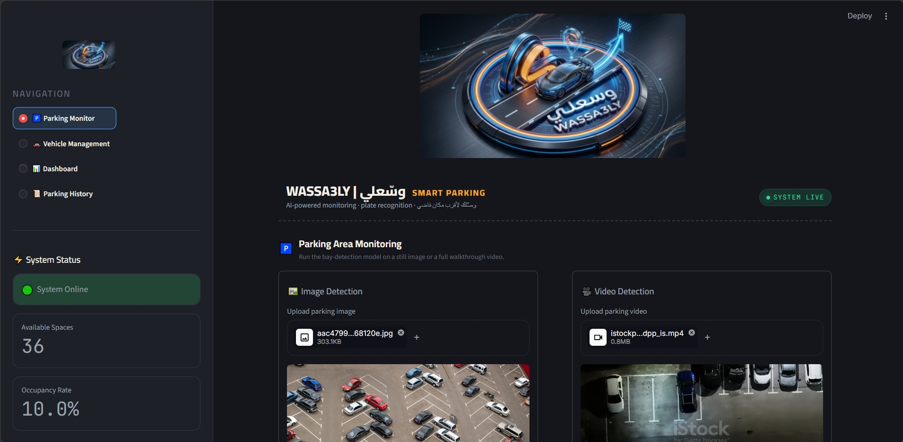
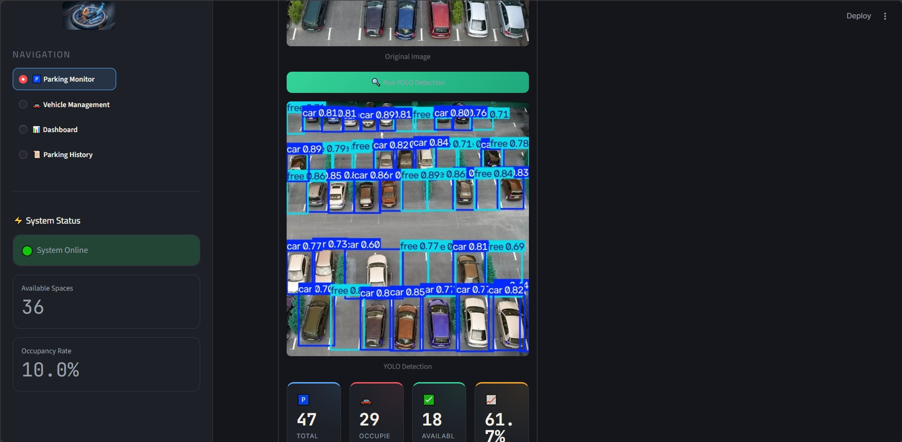
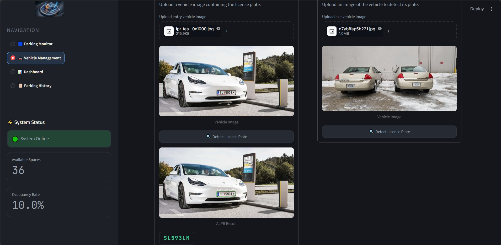
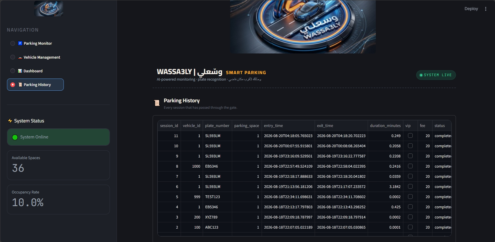

<div align="center">


# 🚗 WASSA3LY | وسّعلي

### AI-Powered Smart Parking Management System

**WASSA3LY** is an AI-powered smart parking management system designed to automate parking monitoring, vehicle identification, parking-space occupancy, parking sessions, and fee calculation.

The system combines **Computer Vision, YOLO, Vehicle Tracking, License Plate Recognition, OCR, Parking Management, SQLite, and Streamlit** into one integrated platform.

<br>


</div>

---

## 📌 Overview

Traditional parking management can require manual monitoring of parking spaces, vehicle entry and exit, and payment calculation.

**WASSA3LY** aims to automate this process using AI and computer vision.

The system can:

* Detect vehicles and parking spaces.
* Determine whether parking spaces are **Available** or **Occupied**.
* Track vehicles during parking activity.
* Detect and recognize license plates.
* Extract plate numbers using OCR.
* Identify vehicles using their plate numbers.
* Manage regular and VIP vehicles.
* Record parking entry and exit times.
* Calculate parking duration.
* Calculate parking fees automatically.
* Store parking data in a SQLite database.
* Display parking statistics through an interactive Streamlit dashboard.

---

## ✨ Key Features

### 🚗 Computer Vision

* AI-based vehicle detection.
* Parking-space detection.
* ROI / Polygon-based parking-space mapping.
* Parking occupancy calculation.

### 🔢 License Plate Recognition

* License plate detection.
* OCR-based plate recognition.
* Fast-ALPR integration.
* Plate-to-vehicle identification.

### 🅿️ Smart Parking Management

* Available / Occupied parking-space status.
* Parking-space assignment.
* Active parking sessions.
* Entry and exit management.
* Parking duration calculation.
* Automatic fee calculation.
* Parking history.

### ⭐ VIP Management

* VIP vehicle identification.
* Separate VIP pricing rule.
* Automatic VIP checking using the vehicle plate.

### 📊 Analytics

* Total parking spaces.
* Occupied spaces.
* Available spaces.
* Occupancy rate.
* Parking statistics.
* Revenue tracking.

### 🗄️ Data Management

* SQLite database.
* Vehicle records.
* Parking-space records.
* Parking-session records.
* VIP records.

### 🖥️ Interactive Dashboard

* Real-time parking monitor.
* Vehicle management.
* Parking statistics.
* Parking history.

---

## 🔄 How It Works

```text
📷 Image / Video
       │
       ▼
🤖 YOLO Detection
       │
       ├───────────────┐
       ▼               ▼
🅿️ Parking          🚘 Vehicle
Occupancy            Tracking
       │               │
       │               ▼
       │          🔢 License Plate
       │               │
       │               ▼
       │          🔍 Fast-ALPR / OCR
       │               │
       └───────┬───────┘
               ▼
        🧠 Parking Logic
               │
       ┌───────┼────────┐
       ▼       ▼        ▼
     ⭐ VIP  ⏱️ Time   💰 Fee
               │
               ▼
          🗄️ SQLite DB
               │
               ▼
        🖥️ Streamlit App
```

---

## 🏗️ System Architecture

WASSA3LY is organized into several integrated layers:

### 1. Computer Vision Layer

Responsible for vehicle and parking-space detection using YOLO and ROI / Polygon regions.

### 2. Tracking & Recognition Layer

Responsible for vehicle tracking, license plate detection, and OCR-based plate recognition.

### 3. Parking Management Layer

Handles parking sessions, vehicle entry and exit, parking duration, fees, VIP logic, and parking history.

### 4. Database Layer

Stores vehicles, parking spaces, parking sessions, and VIP information using SQLite.

### 5. Presentation Layer

Provides an interactive Streamlit dashboard for monitoring and managing the parking system.

---

## 🤖 AI Models & Performance

### 🚗 Parking Detection

The parking detection model was trained to detect two classes:

* `car`
* `free`

### Overall Performance

| Metric        |     Score |
| ------------- | --------: |
| **mAP@50**    | **98.8%** |
| **Precision** | **97.9%** |
| **Recall**    | **97.4%** |

### Dataset

* **2,963 images**
* **2 classes**
* **8 dataset versions**

### Per-Class Performance

| Class | Precision | Recall | mAP@50 |
| ----- | --------: | -----: | -----: |
| Car   |     94.7% |  91.1% |  93.7% |
| Free  |     94.0% |  89.6% |  93.3% |

---

## 🔢 License Plate Recognition

WASSA3LY integrates **Fast-ALPR** for automatic license plate recognition.

| Component              | Model                                 |
| ---------------------- | ------------------------------------- |
| License Plate Detector | `yolo-v9-t-384-license-plate-end2end` |
| OCR                    | `cct-xs-v2-global-model`              |

**Average OCR Confidence:** `96.7%`

The recognized plate number is passed to the parking-management system to identify and manage the corresponding vehicle.

---

## 🅿️ Parking Occupancy

Parking spaces are represented using **ROI / Polygon regions**.

For every parking space, the system determines its current status:

* 🟢 **Available**
* 🔴 **Occupied**

The system calculates:

* Total Spaces
* Occupied Spaces
* Available Spaces
* Occupancy Rate

### Occupancy Rate

```text
Occupancy Rate =
(Occupied Spaces / Total Spaces) × 100
```

---

## 🧠 Parking Management

The parking lifecycle is managed automatically:

```text
Vehicle Entry
      ↓
License Plate Recognition
      ↓
Vehicle Identification
      ↓
Parking Space Assignment
      ↓
Active Parking Session
      ↓
Vehicle Exit
      ↓
Duration Calculation
      ↓
Fee Calculation
      ↓
Parking History
```

---

## ⭐ VIP & Pricing

WASSA3LY supports VIP vehicles with a separate pricing rule.

The system automatically checks the recognized license plate against the VIP database.

| Vehicle Type |           Fee |
| ------------ | ------------: |
| 🚗 Regular   | **20 / hour** |
| ⭐ VIP        | **40 / hour** |

---

## 📊 Streamlit Dashboard

The application provides an interactive dashboard with dedicated sections for parking monitoring and management.

| Page                      | Description                                     |
| ------------------------- | ----------------------------------------------- |
| 🅿️ **Parking Monitor**   | Parking occupancy and parking-space status      |
| 🚘 **Vehicle Management** | Vehicle information and active parking sessions |
| 📈 **Dashboard**          | Parking statistics and key KPIs                 |
| 🕒 **Parking History**    | Previous parking sessions                       |

---

## 🗄️ Database

WASSA3LY uses **SQLite** for local data management.

### Main Tables

* `Vehicles`
* `Parking Spaces`
* `Parking Sessions`
* `VIP`

The database stores:

* Vehicle information
* Parking-space information
* Entry and exit times
* Parking duration
* Parking fees
* VIP information
* Parking history

---

## 🛠️ Tech Stack

| Category                      | Technologies              |
| ----------------------------- | ------------------------- |
| **Programming**               | Python                    |
| **AI / Computer Vision**      | YOLO, Ultralytics, OpenCV |
| **License Plate Recognition** | Fast-ALPR, OCR            |
| **Backend**                   | Python                    |
| **Database**                  | SQLite, SQL               |
| **Frontend**                  | Streamlit                 |
| **Data Processing**           | NumPy, Pillow             |

---

## 📁 Project Structure

```text
WASSA3LY/
│
├── assets/
│   ├── logo.png
│   ├── screenshots/
│   │   ├── parking-monitor-1.png
│   │   ├── parking-monitor-2.png
│   │   ├── yolo-detection.png
│   │   ├── vehicle-management.png
│   │   ├── dashboard.png
│   │   └── parking-history.png
│   ├── demo.mp4
│   └── WASSA3LY_Presentation.pptx
│
├── backend/
│   ├── database.py
│   └── parking_logic.py
│
├── models/
│   └── ...
│
├── app.py
├── integration.py
├── requirements.txt
├── .gitignore
└── README.md
```

---

## ⚙️ Installation

### 1. Clone the Repository

```bash
git clone https://github.com/SalmaNageh/-WASSA3LY-.git
cd -WASSA3LY-
```

### 2. Create a Virtual Environment

```bash
python -m venv venv
```

### 3. Activate the Environment

#### Windows

```bash
venv\Scripts\activate
```

#### Linux / macOS

```bash
source venv/bin/activate
```

### 4. Install Dependencies

```bash
pip install -r requirements.txt
```

### 5. Run the Application

```bash
streamlit run app.py
```

The Streamlit application will then open in your browser.

---

## 📸 Application Screenshots

### 🅿️ Parking Monitor

| Parking Monitor |  YOLO Detection |
|---|---|
|   |  |

### 🚗 Vehicle Management



### 📈 Dashboard


### 🕒 Parking History



## 🔗 Project Links

### 📂 GitHub Repository

[**WASSA3LY GitHub Repository**](https://github.com/SalmaNageh/-WASSA3LY-)

### 📑 Project Presentation

[**WASSA3LY Presentation**](assets/WASSA3LY_Presentation.pptx)

### 🎥 Demo

The project demo video is available below:

[🎥 Watch the WASSA3LY Demo](assets/Demo_Parking.mp4)

## 👥 Team

| Member                                   | Role                                    |
| ---------------------------------------- | --------------------------------------- |
| **Rawda Badawy Ali Abdel Tawab**         | Computer Vision & YOLO Engineer         |
| **Kerimena Ehab Hafez Badee**            | Tracking & License Plate / OCR Engineer |
| **Salma Mohamed Nageh Abdelhamid**       | Backend, Database & System Architecture |
| **Fatma Al-Zahraa Ibrahim Abbas Salman** | Streamlit & System Integration          |

### 👩‍💻 Rawda Badawy Ali — Computer Vision & YOLO

* Dataset preparation and cleaning
* YOLO training and evaluation
* Vehicle detection
* Parking-space detection
* ROI / Polygon mapping
* Occupancy calculation

### 👩‍💻 Kerimena Ehab Hafez — Tracking & OCR

* Object tracking
* Vehicle IDs
* License plate detection
* OCR
* Fast-ALPR integration
* Plate-to-vehicle identification

### 👩‍💻 Salma Mohamed Nageh — Backend & System Architecture & integration

* Database design
* Parking logic
* Entry / exit management
* Duration and fee calculation
* VIP logic
* Parking history
* Revenue calculation
* System architecture and integration

### 👩‍💻 Fatma Al-Zahraa Ibrahim — Streamlit

* Streamlit UI
* Parking Monitor
* Dashboard
* Vehicle Management
* Parking History

---

## 🔗 Team Links

| Member                      | GitHub                                             | LinkedIn                                                        |
| --------------------------- | -------------------------------------------------- | --------------------------------------------------------------- |
| **Rawda Badawy Ali**        | [GitHub](https://github.com/rawdabadawy092-design) | [LinkedIn](https://www.linkedin.com/in/rawda-badawy-a67408328)  |
| **Kerimena Ehab Hafez**     | [GitHub](https://github.com/Kermina-Ehab598)       | [LinkedIn](https://www.linkedin.com/in/kermina-ehab-53981b332)  |
| **Salma Mohamed Nageh**     | [GitHub](https://github.com/SalmaNageh)            | [LinkedIn](https://www.linkedin.com/in/salma-nageh)             |
| **Fatma Al-Zahraa Ibrahim** | [GitHub](https://github.com/FatmaAlzahraa9925)     | [LinkedIn](https://www.linkedin.com/in/fatma-ibrahim-b7a04329/) |

---

## 🚀 Future Improvements

Planned improvements include:

* 📹 Real-time CCTV integration
* 📱 Mobile application
* 💳 Online payment
* ☁️ Cloud database
* 📈 Advanced parking analytics
* 🗺️ Multi-parking support
* 🔔 Parking availability notifications

---

<div align="center">

## ❤️ WASSA3LY | وسّعلي

### Smart Parking. Smarter Management. 🚗🅿️

</div>
